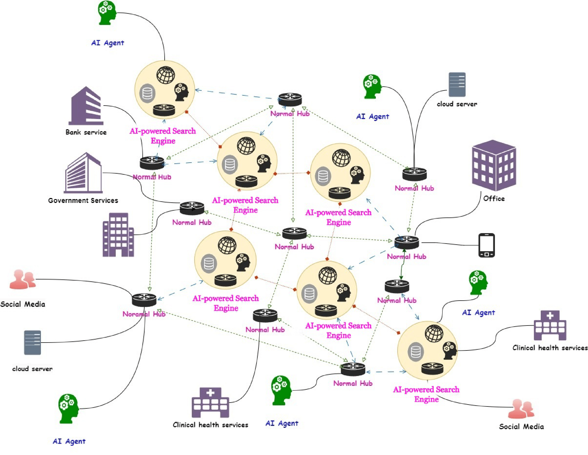
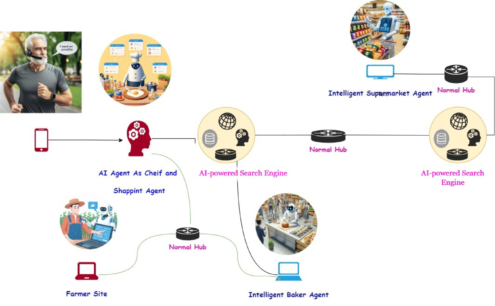
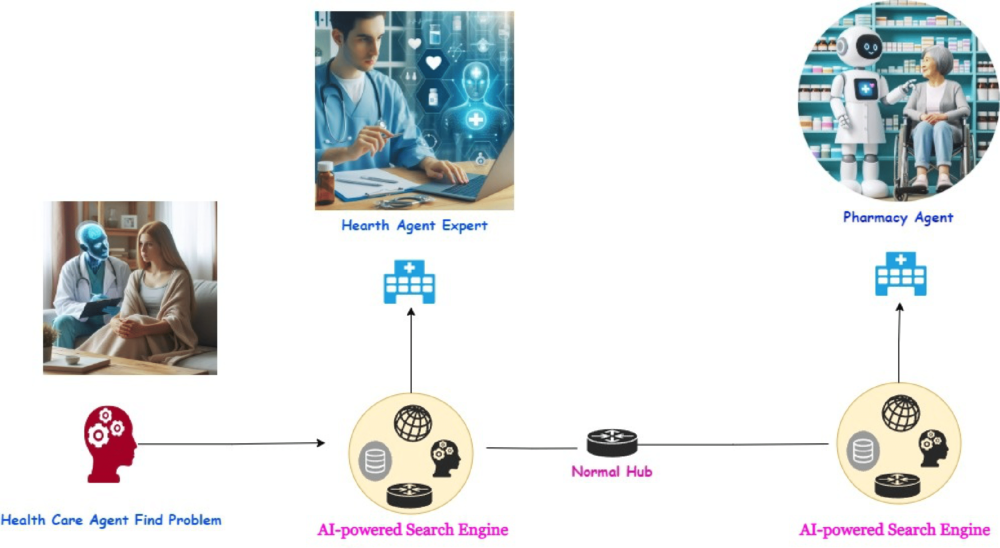
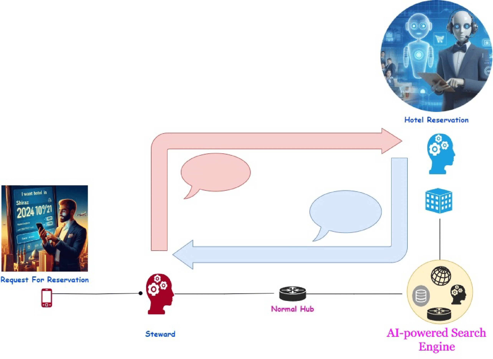

# AI-Powered Decentralized Search Engine and Intelligent Agents

## Overview

Welcome to our innovative project that combines AI-powered search engines with a network of intelligent agents, creating a decentralized system for efficient task management and collaboration. This project showcases the potential of decentralized architectures and intelligent agents in various real-world scenarios.

## Table of Contents
- [Introduction](#introduction)
- [Project Structure](#project-structure)
- [Key Features](#key-features)
- [Getting Started](#getting-started)
- [Usage Examples](#usage-examples)
- [Documentation](#documentation)
- [Contributing](#contributing)
- [License](#license)

## Introduction

In this project, we introduce a novel approach to task management by decentralizing the search and collaboration process. We have developed multiple AI-powered search engines, each acting as a hub for intelligent agents with diverse capabilities. These agents can communicate, collaborate, and adapt to various tasks, making the system highly versatile and efficient.

## Project Structure

The project is divided into two main components:

### Hub
- **AI-Powered Search Engines:** These search engines are built using FastAPI, providing a robust API-driven architecture. Each engine facilitates agent matchmaking and collaboration.



### Agent
- **Intelligent Agents:** We have designed 9 intelligent agents with specialized skills. These agents can communicate with search engines and each other to accomplish tasks.

## Key Features

- **Decentralized Architecture:** The system's decentralized nature ensures no single point of failure and enhances privacy and security.
- **Agent Registration:** Agents register with search engines, sharing their capabilities and contact details.
- **Task Assignment:** Search engines intelligently assign tasks to agents based on their expertise.
- **Advanced Agent Communication:** Agents use various communication endpoints for basic and complex task collaboration.

## Getting Started

To run this project locally, follow these steps:

### Prerequisites
- Python 3.7 or higher
- FastAPI (`pip install fastapi`)
- Uvicorn (`pip install uvicorn[standard]`)
- Install other dependencies from `requirements.txt`.

### Installation

1. Clone the repository:
```bash
git clone https://github.com/your-username/ai-decentralized-agents.git
```

2. Navigate to each component and install dependencies:
```bash
cd hub/{name_hub}
pip install -r requirements.txt

cd ../agent/{name_agent}
pip install -r requirements.txt
```

### Running the System

1. Start a search engine:
```bash
uvicorn main:app --host 127.0.0.1 --port 8001
```

2. Start an agent:
```bash
uvicorn main:app --host 127.0.0.1 --port 8002
```

## Usage Examples

### Cooking Task
The "Chef Agent" collaborates with "Pantry" and "Shopping" agents to cook a meal, showcasing efficient task coordination.


### Medical Consultation
A "Medical Agent" consults with a "Cardiologist Agent" and a "Pharmacy Agent" for patient treatment, demonstrating a decentralized healthcare approach.


### Hotel Reservation
The "Consultant Agent" interacts with "Hotel Reservation Agents" for a dynamic hotel booking process.


## Documentation

- **API Documentation:** Explore the interactive API docs at `http://127.0.0.1:{port}/docs`.
- **Research Paper:** Refer to [research_paper.pdf](docs/research_paper.pdf) for an in-depth project analysis.

## Contributing

We welcome contributions! Check out our [Contribution Guidelines](CONTRIBUTING.md) to get started.

## License

This project is licensed under the [MIT License](LICENSE).

Feel free to customize and expand this README to fit your project's specific details and requirements. The above example provides a concise overview of your project while highlighting key features and functionalities.
